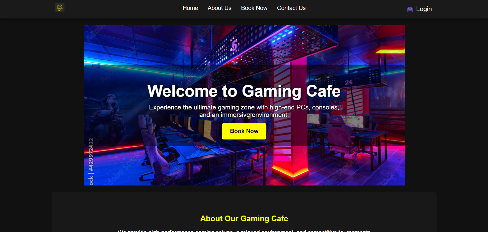
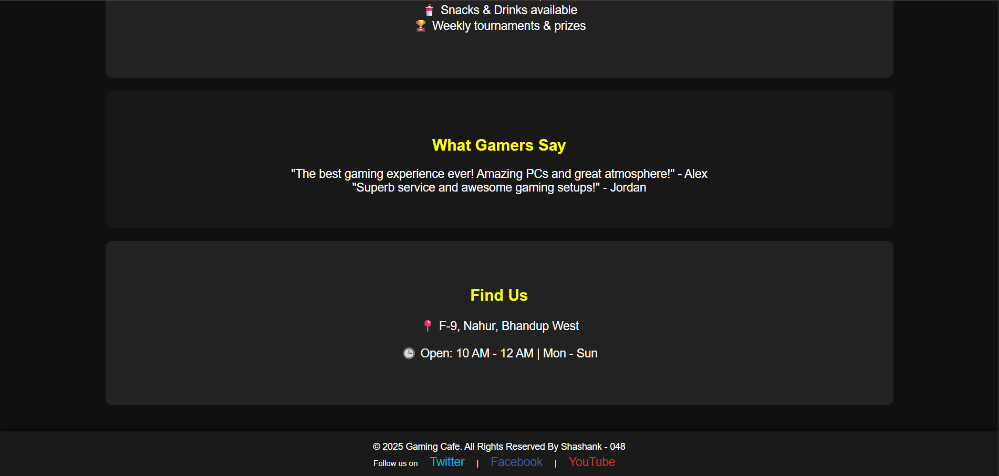
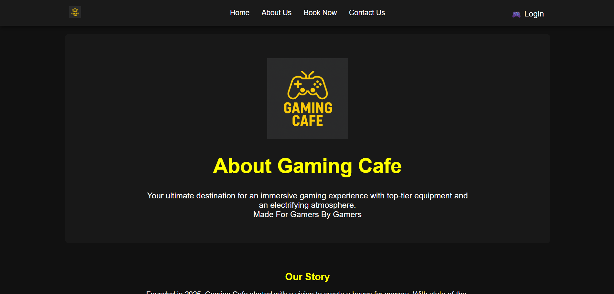
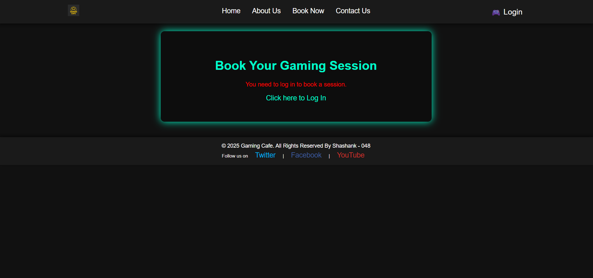
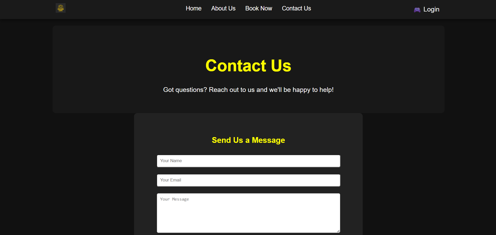

<h1 align="center" style="font-size: 3rem; font-weight: 800; margin-bottom: 0;">
  🎮 GAMING CAFE MANAGEMENT SYSTEM
</h1>

<h3 align="center" style="font-size: 1.4rem; font-weight: 400; color: #555;">
  ASP.NET Web Forms • SQL Server • College Project
</h3>

<br>

<p align="center">
  <a href="https://github.com/YOUR_USERNAME/YOUR_REPO_NAME/stargazers">
    
  </a>
  <a href="https://github.com/YOUR_USERNAME/YOUR_REPO_NAME/network/members">
    
  </a>
  <a href="https://github.com/YOUR_USERNAME?tab=followers">
    
  </a>
</p>

<p align="center">

  <!-- C# -->
  

  <!-- ASP.NET -->
  

  <!-- .NET Framework -->
  

  <!-- SQL Server -->
  

  <!-- HTML -->
  

  <!-- CSS -->
  
</p>

<p align="center">
  <a href="LICENSE">
    
  </a>
</p>

---

## 📌 One-Line Summary
The **Gaming Café Management System** is a web-based application developed as a **college project** to streamline and digitize the daily operations of a gaming café. The website allows users to **register**, **log in**, and **book gaming systems** by selecting their preferred **gaming type**, **date**, **time**, and **number of players**. On the administrative side, the system provides tools for **managing users**, **monitoring bookings**, and handling **customer inquiries** submitted through the contact form. This project was created to demonstrate practical skills in **ASP.NET Web Forms**, **C#**, and **SQL Server**, showcasing how to build a functional, database-driven application that mirrors real-world workflows used in modern gaming cafés and entertainment centers.

---

## 📋 Table of Contents
- [✨ Features](#-features)
- [🧰 Tech Stack](#-tech-stack)
- [📂 Project Structure](#-project-structure)
- [⚙️ How to Run Locally](#️-how-to-run-locally)
- [🗄️ Database Setup](#️-database-setup)
- [🗄️ Database Schema & Table Creation](#️-database-schema--table-creation)
- [📸 Screenshots](#-screenshots)
- [🧹 Repo Cleanup Notes](#-repo-cleanup-notes)
- [📈 Future Improvements](#-future-improvements)
- [👨‍💻 Author](#-author)
- [📄 License](#-license)

---

## ✨ Features

### 🔐 **Admin Features**
- Admin Login/Authentication  
- View dashboard analytics  
- Manage Users (view / update / delete)  
- Manage Bookings  
- Manage Contact Messages  

### 👤 **User Features**
- Register / Login  
- Book systems (PC/Game Session)  
- View home & info pages  
- Submit contact form  

### 🌐 **General**
- Clean UI with ASPX pages  
- Reusable Master Pages  
- SQL Server backend  
- Form validation  

---

## 🧰 Tech Stack

| Technology | Purpose |
|-----------|----------|
| **ASP.NET Web Forms** | Main application framework |
| **C# (.NET Framework 4.7.2)** | Backend logic |
| **SQL Server Express / LocalDB** | Database |
| **ADO.NET** | Database connectivity |
| **HTML5, CSS3** | Frontend UI |
| **Bootstrap** *(optional)* | Styling (if used) |

---

## 📂 Project Structure
Gaming Cafe/<br>
├── Admin/ # Admin pages<br>
├── Homelmages/ # Images / assets<br>
├── *.aspx # Main UI pages<br>
├── *.aspx.cs # Backend C# logic<br>
├── *.designer.cs # Auto-generated<br>
├── Web.config # DB connection + configs<br>
Gaming Cafe.sln # Solution file<br>

---

## ⚙️ How to Run Locally

1. Install **Visual Studio 2019/2022**
2. Install **SQL Server Express** or **LocalDB**
3. Clone or download the project  
4. Open `Gaming Cafe.sln` in Visual Studio  
5. Restore NuGet packages (auto)  
6. Create the database named:  **Gamercafe**
7. Run the SQL tables below OR create them manually  
8. Update the `Web.config` connection string  
9. Press **F5** to run  
---

## 🗄️ Database Setup

Default connection string (already safe to commit):
```
Data Source=localhost\SQLEXPRESS;
Initial Catalog=Gamercafe;
Integrated Security=True;
Encrypt=False;
```
### If using LocalDB:
```
Server=(localdb)\MSSQLLocalDB;
Database=Gamercafe;
Integrated Security=True;
```
---

# 🗄️ Database Schema & Table Creation

Below are **step-by-step SQL commands** to create all tables required by the project.

---

## **1️⃣ Create the `User` Table**
```sql
CREATE TABLE [dbo].[User] (
    [Id]        INT IDENTITY (1, 1) NOT NULL PRIMARY KEY,
    [Full_Name] NVARCHAR (50) NOT NULL,
    [Email]     NVARCHAR (50) NOT NULL,
    [Password]  NVARCHAR (50) NOT NULL
);
```
✔ Table Design

Id — Primary key
Full_Name — User’s full name
Email — Login email
Password — Plain password (from your project).
⚠ In production: store hashed passwords

## **2️⃣ Create the `Contacts` Table**
```
CREATE TABLE [dbo].[Contacts] (
    [Id]       INT IDENTITY (1, 1) NOT NULL PRIMARY KEY,
    [Name]     NVARCHAR (100) NOT NULL,
    [Email]    NVARCHAR (50) NOT NULL,
    [Message]  NVARCHAR (MAX) NOT NULL
);
```
✔ Table Design
Stores contact form submissions

## **3️⃣ Create the `Bookings` Table**
```
CREATE TABLE [dbo].[Bookings] (
    [BookingID]  INT IDENTITY (1, 1) NOT NULL PRIMARY KEY,
    [Name]       NVARCHAR (255) NOT NULL,
    [UserEmail]  NVARCHAR (255) NOT NULL,
    [GamingType] NVARCHAR (100) NOT NULL,
    [Date]       DATE NOT NULL,
    [Time]       TIME (7) NOT NULL,
    [Hours]      INT NOT NULL,
    [Players]    INT NOT NULL
);
```
✔ Table Design
UserEmail links bookings to users
GamingType stores type (e.g., PC, PS5, VR)
Includes number of Hours and Players

---


## 📸 Screenshots (Preview)

<p style="margin:6px 0; font-size:0.95rem; color:#444;">
  Click a thumbnail to view the full-size screenshot in a new tab. or click here
</p>

<p align="center" style="line-height:0;">
  <a href="Screenshot/ss1.png" target="_blank" rel="noopener"></a>
  <a href="Screenshot/ss2.png" target="_blank" rel="noopener"></a>
  <a href="Screenshot/ss3.png" target="_blank" rel="noopener"></a>
  <a href="Screenshot/ss4.png" target="_blank" rel="noopener"></a>
  <a href="Screenshot/ss5.png" target="_blank" rel="noopener"></a>
</p>

---

## 🧹 Repo Cleanup Notes
These folders were intentionally **removed** for professionalism:

- `.vs/`
- `bin/`
- `obj/`
- `packages/`

Visual Studio will **automatically restore** everything needed.

---

## 📈 Future Improvements
- Migrate to ASP.NET MVC or ASP.NET Core  
- Add Entity Framework  
- Add role-based authentication  
- Add better UI styling  
- Add invoice generation for bookings  

---

## 👨‍💻 Author

Quastro
---

## 🤝 Contributions & Usage

Feel free to use or improve this project!  
If you do use the code, UI, or database from this repository, we kindly ask that you:

⭐ **Give credit** by linking back to our repo  
🔗 https://github.com/Quastro0/Gaming-Cafe-website 

This small gesture really helps us and keeps the project growing.  
Pull requests and suggestions are always welcome!


## 📄 License
This project is licensed under the **MIT License**.  
You may use or modify it for learning and educational purposes.


